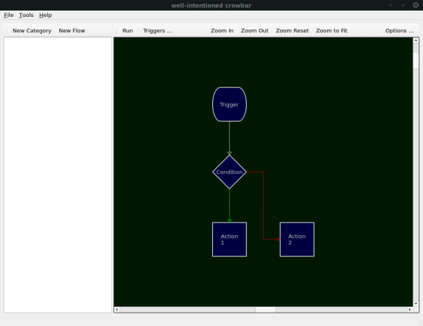

# well-intentioned crowbar
The **well-intentioned crowbar** is a desktop task automation tool with an intuitive visual boxes-and-arrows workflow interface.

## Intent

It is well-known that many users don't outright _desire_ to "get dirty" on a scary command line, they "just want things to work" ... but perhaps a little differently than they do by default.

The well-intentioned crowbar aims to provide a general-purpose automation tool for open source desktop environments. With the crowbar, you can build a graphical flow chart to describe a task, and such tasks will then automatically run when the corresponding trigger events occur.

For instance:
 - you might want your laptop to remember and automatically restore your preferred screen configurations as you move between your home, your desk at the office, and various meeting rooms. There already exists an excellent tool for that particular example, but it does involve venturing into the realm of the command line.
 - you might want the setting for what is your default printer to change appropriately as you move between your home and your office. This, too, is doable with "just a bit of scripting".
 - you might want to change your preferred audio devices when they are (un)plugged. Again, doable, but it doesn't "just happen" out of the box.

These are some of the things you will be able to do from the familiar comfort of a normal desktop application.

### Motivation

I'm using somewhat of a [hack](https://github.com/Noughtnaut/noughty-autorandr) to automatically change my default printer according to the current network connection. It works, but for the wrong reasons. I'd like to make a decent solution for this _and similar_ needs, and I've been meaning to get into open source desktop app development, so I took this as my cue. If I could make something like [Automagic](http://automagic4android.com/), that would be neat.

Further, there once was a desktop app called [Cuttlefish](https://launchpad.net/cuttlefish) which could do sort of what I was after, albeit not as elaborate as Automagic. The fact that it has seen no upkeep since 2012 but the last bug report is from 2017 indicates that people do go out of their way to achieve some level of automation.

<!--- TODO
## Installation
--->

## Usage

During installation, the crowbar will set itself up to start when you log in, but will remain unobtrusive. You only need to open it when you want to create or modify what tasks it's supposed to automate for you. You will find the crowbar in your application menu, or you can click on its icon in the system tray.

## Changes

The [roadmap](ROADMAP.md) describes what is being considered for the future. Also, the [change log](CHANGELOG.md#unreleased) might show things that are further along, albeit still unreleased.

<!---
#TODO
## Contributing
--->

## License

This software is distributed under the terms of the GNU General Public License v2 ([TL;DR](https://tldrlegal.com/license/gnu-general-public-license-v2)).

## Thanks

<!---
### Heritage
--->
 Not so long ago there was a very neat [automation tool](http://automagic4android.com/) [for Android](https://play.google.com/store/apps/details?id=ch.gridvision.ppam.androidautomagic) that allowed you to do all sorts of things in a very intuitive graphical manner using flowchart block and arrows. Sadly, that project is [no longer maintained](http://automagic4android.com/forum/viewtopic.php?f=5&t=8787), but it gave me the inspiration to replicate the experience for the desktop.

 I would not have even looked for Automagic if it weren't for [Llama](http://kebabapps.blogspot.com/), the "location aware mobile application", which let me automate so many things way back on Android 1.5. It too, sadly, was felled by the rapidly changing nature of Android.

<!---
### Contributors
--->
